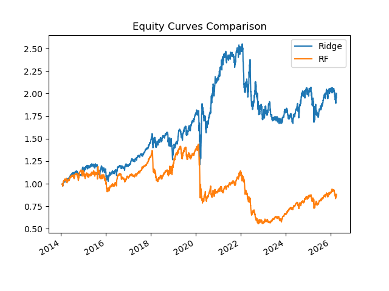
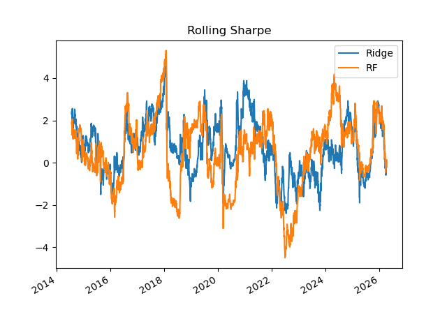
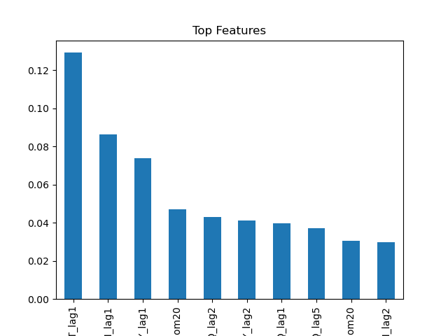
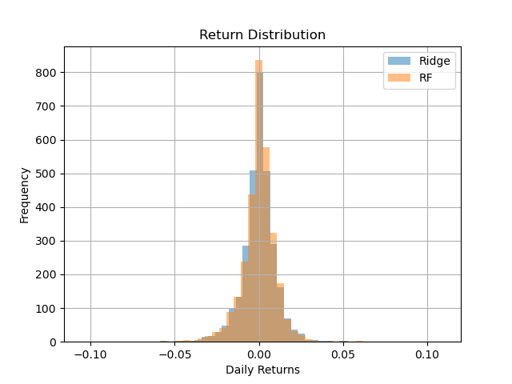

# Machine Learning Statistical Arbitrage

## Overview

This project implements a production-style quantitative research pipeline for developing and evaluating statistical arbitrage strategies using machine learning on financial time-series data.

The workflow emphasizes:
- predictive modelling
- robust backtesting
- handling non-stationary data
- reproducibility and clean engineering practices

---

## Objective

The objective is to construct data-driven trading signals that predict short-term returns across liquid exchange-traded funds (ETFs) and to evaluate these signals using realistic, out-of-sample backtesting.

---

## Project Structure

```
ml_stat_arb/
│
├── src/
│   ├── __init__.py
│   ├── data.py
│   ├── features.py
│   ├── models.py
│   ├── walkforward.py
│   ├── backtest.py
│   └── metrics.py
│
├── notebooks/
│   └── offline_pipeline.ipynb
│
├── scripts/
│   └── download_data.py
│
├── data/
│   ├── raw/
│   └── processed/
│       └── prices.csv
│
├── results/
│   ├── plots/
│   ├── metrics.csv
│   ├── returns.csv
│   └── predictions.csv
│
├── configs/
│   └── config.yaml
│
├── requirements.txt
├── README.md
└── .gitignore
```

---

## Data

The project uses daily price data for liquid ETFs, including:

SPY, QQQ, IWM, TLT, IEF, SHY, GLD

A cached dataset is stored at:
data/processed/prices.csv

To regenerate the dataset:
python scripts/download_data.py

---

## Methodology

### Feature Engineering
- lagged returns
- rolling volatility
- momentum signals
- cross-asset spreads

### Models
- Ridge regression
- Random Forest

### Validation
Walk-forward validation is used to avoid lookahead bias.

### Backtesting
Signals:
w_t = sign(r̂_{t+1})

Returns:
r_strategy_t = w_{t-1} * r_t

Includes transaction costs and performance metrics.

---

## Results

### Performance Summary

| Model         | Sharpe | Mean Return | Volatility |
|---------------|--------|------------|------------|
| Ridge         | 0.40–0.45 | ~0.030%     | ~1.0%      |
| Random Forest | 0.02–0.03 | ~0.002%     | ~1.0%      |

Results are based on walk-forward validation with transaction costs.

---

### Equity Curve



---

### Rolling Sharpe Ratio



---

### Feature Importance



---

### Return Distribution



---

### Output Files

- results/metrics.csv
- results/returns.csv
- results/predictions.csv

---

## Reproducibility

1. Install dependencies:
pip install -r requirements.txt

2. Run notebook:
notebooks/offline_pipeline.ipynb

---

## Key Considerations

- financial time-series are non-stationary
- overfitting mitigated via walk-forward validation
- transaction costs impact performance

---

## Author

Aditya Bawane
PhD, Mathematical Physics
Quantitative Research | Machine Learning | Time Series
